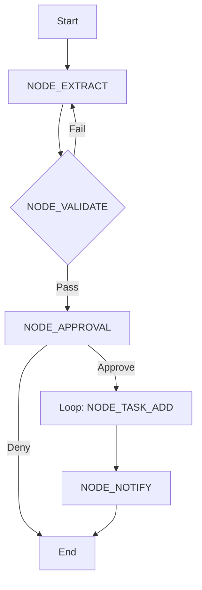

# 1.3 Decomposition Planning: Vague Task Decomposition

## Master Atomic Node List

The project is decomposed into the following atomic operations:

| Node ID | Type | Responsibility | Input | Output |
| :--- | :--- | :--- | :--- | :--- |
| `NODE_EXTRACT` | LLM | Decompose text into JSON array. | `{ "text": string }` | `[ "task1", "task2", ... ]` |
| `NODE_VALIDATE` | Logic | Verify JSON schema and string lengths. | `string` (LLM output) | `boolean` or `error` |
| `NODE_APPROVAL` | Human | Review subtasks and confirm. | `string[]` | `boolean` |
| `NODE_TASK_ADD` | Tool | Execute `gog tasks add` via shell. | `string` (Task title) | `string` (Task ID) |
| `NODE_NOTIFY` | LLM | Summarize the result for the user. | `TaskID[]` | `string` |

## Workflow Topology (Lobster)

## Standardized Work Checkpoint
- [x] Are all nodes single-responsibility?
- [x] Is the feedback loop (Jidoka) defined? (Loop back to Extract on validation failure)
- [x] Is the human-in-the-loop (HITL) gate present?
